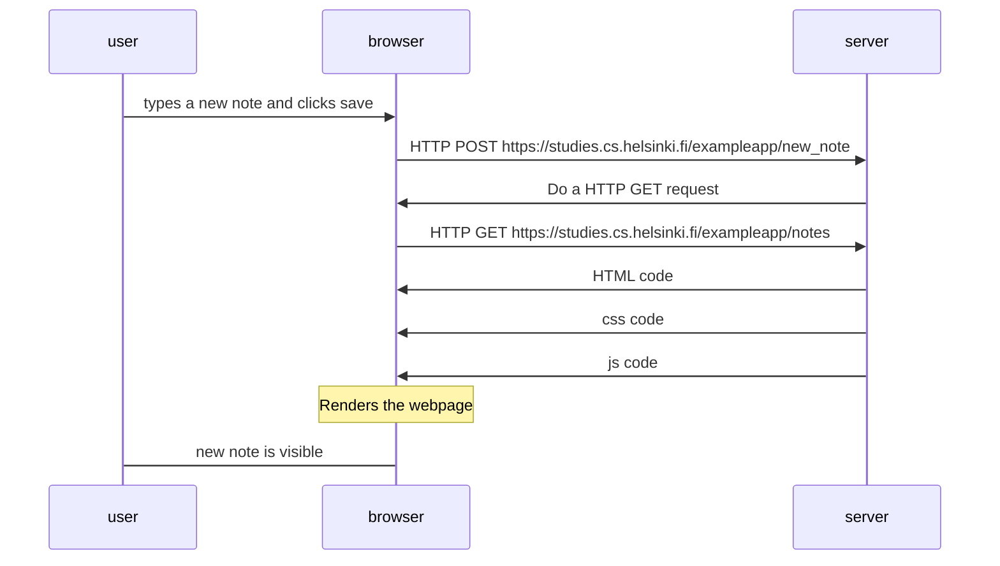

```mermaid
sequenceDiagram
    participant user
    participant browser
    participant server

    user->>browser:types a new note and clicks save
    browser->>server:HTTP POST https://studies.cs.helsinki.fi/exampleapp/new_note
    server->>browser: Do a HTTP GET request
    browser->>server: HTTP GET https://studies.cs.helsinki.fi/exampleapp/notes
    server->>browser: HTML code
    server->>browser: css code
    server->>browser: js code

Note over browser: Renders the webpage 

    user->browser: new note is visible


```