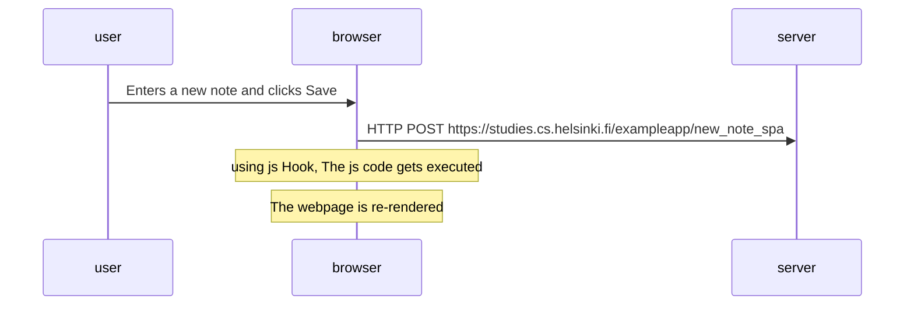

```mermaid

sequenceDiagram
    participant user
    participant browser
    participant server

    user->>browser: Enters a new note and clicks Save
    browser->>server: HTTP POST https://studies.cs.helsinki.fi/exampleapp/new_note_spa

Note over browser:using js Hook, The js code gets executed

Note over browser:The webpage is re-rendered

```